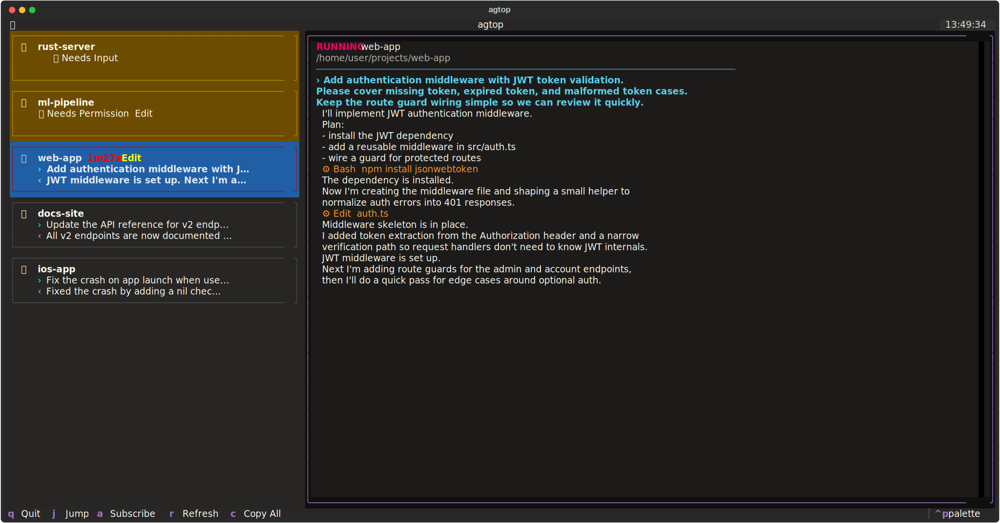

# agtop

TUI monitor for AI coding agents — [Claude Code](https://docs.anthropic.com/en/docs/claude-code), [Codex CLI](https://github.com/openai/codex) and more.




## Features

- Live status tracking: working, idle, waiting for input/permission, done
- Conversation preview with tool call summaries
- One-key jump to the terminal tab/pane running a session
- macOS notifications + bell when a session needs attention
- Subscribe to sessions for task-completion alerts
- Supports Claude Code and OpenAI Codex CLI
- Terminal support: iTerm2, WezTerm, Terminal.app, Warp, Kaku, tmux

## Install

### Homebrew

```bash
brew install lhead/tap/agtop
```

### pip

```bash
pip install agtop
```

## Usage

```bash
agtop
```

### Keybindings

| Key | Action |
|-----|--------|
| `j` | Jump to session's terminal tab |
| `a` | Subscribe/unsubscribe to completion alerts |
| `r` | Force refresh |
| `c` | Copy session detail to clipboard |
| `q` | Quit |

## Configuration

`~/.config/agtop/config.toml`

```toml
[general]
show_recent_hours = 4   # Show closed sessions from last N hours
max_sessions = 20       # Max sessions in list

[refresh]
fast = 1                # Seconds - when active sessions exist
slow = 3                # Seconds - when all idle/done

[notifications]
enabled = true          # macOS notification for waiting sessions
sound = true            # Terminal bell
```

## License

MIT
